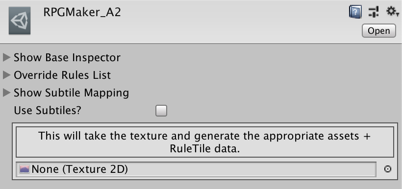

# SubTileAutoTile

## Usage
Drag and drop an A2-formatted texture onto the Texture2D parameter on the RPGMaker_A2.  This will slice the source sprite into Subtiles, as well as generate a RuleTile in that same folder.  You should use a Tilemap on a Grid with half-sized cells, and paint your map with the included Modulo Brush.  See the Examples folder for example usage & output.

## Notes
### Import Settings
This tool makes no assumptions about import settings for your tiles, but `Assets/AutoTile/Examples/Editor/AssetPreProcessor.cs` is used in the examples folder to adjust the import settings for the example sprites.  This is a handy starting point for establishing your own default import settings, or it can be deleted to restore Unity's defaults.

### ScriptableObject
I left the basic usage in the actual data ScriptableObject for my own reasons, but if you are feeling keen, its not a lot of work to adjust the functionality to a `right click` action.
